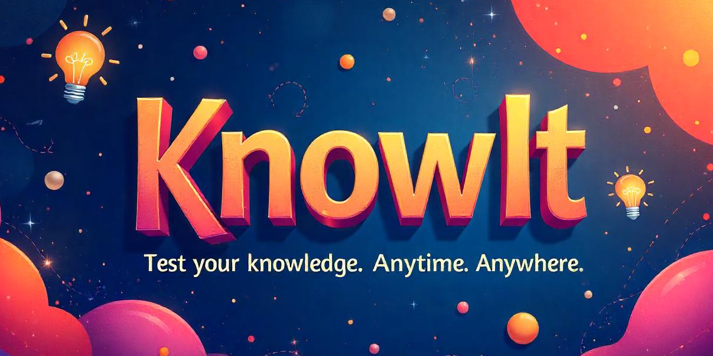

# KnowIt

**KnowIt** is an AI-powered trivia quiz platform where users can explore existing quiz topics or create their own and challenge themselves in real time. Designed for learning through fun and curiosity, KnowIt blends handcrafted and AI-generated quizzes to create an engaging, interactive experience.

Whether you're testing your knowledge about the Solar System or diving into Japanese culture, KnowIt makes trivia accessible, insightful, and entertaining.

🚀 Built with NextJS, FastAPI and PostgreSQL (Supabase), KnowIt is currently in active development.

Stay tuned as we evolve into a smarter, more dynamic trivia engine!
